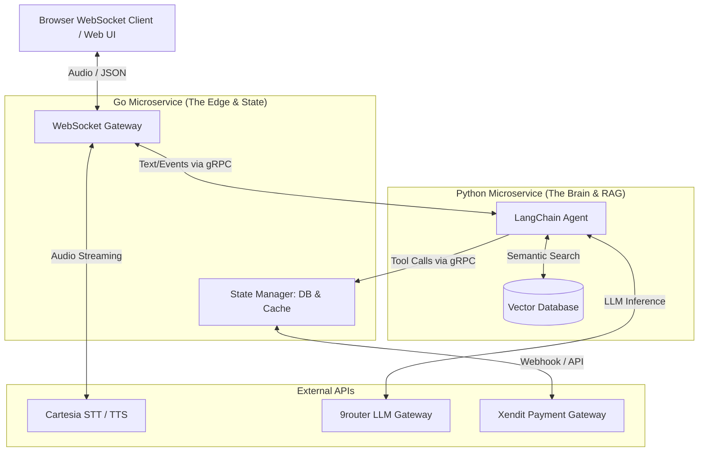

# Hotel Booking Voice Agent: Hybrid Architecture

## Overview
This document outlines the microservice architecture for the Hotel Booking Voice Agent, leveraging both **Go** and **Python** to create a highly scalable, low-latency, and stateless AI system.

## Core Philosophy
- **Go (The Edge):** Handles all state, I/O, concurrency, and real-time streaming.
- **Python (The Brain):** A completely stateless reasoning engine powered by LangChain.

---

## 1. System Architecture



## 2. Component Details

### A. Go Microservice (The Edge)
**Responsibilities:**
- Manage WebSocket connections with frontend clients.
- Stream raw PCM audio up to Cartesia STT and receive transcripts.
- Stream generated text chunks to Cartesia TTS and pipe audio back to the client.
- **Centralized State:** Manage connection pools for Redis (Cache) and SQLite/PostgreSQL (Database).
- Serve as the gRPC server that the Python tools call into for state mutations.
- **Payment Processing:** Handles Xendit API calls (generating QRIS or Virtual Accounts) and listens for Xendit Webhooks to finalize bookings securely.

### B. Python Microservice (The Brain)
**Responsibilities:**
- Process text transcripts using LangChain/LangGraph.
- Maintain conversational flow (system prompts).
- Execute Tool calls (e.g., checking room availability).
- **RAG (Retrieval-Augmented Generation):** Generates vector embeddings entirely locally using HuggingFace models (e.g., all-MiniLM) and queries a FAISS Vector Database to retrieve semantic context about hotel policies, amenities, or local tourist spots.
- **Statelessness:** When a booking tool is triggered, Python acts as a gRPC client and sends an RPC request to the Go service to perform the database transaction.

### C. Web Frontend (The Interfaces)
We will build two distinct interfaces to showcase a complete product:

**1. Guest UI (The Full Booking Portal)**
- **Purpose:** A complete, interactive hotel booking website (similar to Booking.com or Airbnb) augmented with a Voice AI Concierge.
- **Design:** A rich, immersive web app displaying hotel rooms, photo galleries, date pickers, pricing, and a booking cart.
- **Features:** Users can navigate and book traditionally (clicking buttons, selecting dates) OR they can tap the "Voice Concierge" overlay. If they say, "Show me suites available this weekend," the AI triggers events that visually filter the UI to show only suites. If they say, "Book the Deluxe Room," the AI visually populates the booking cart on screen.

**2. Admin UI (The Manager Dashboard)**
- **Purpose:** The back-office view for hotel staff.
- **Design:** A clean, data-rich glassmorphism dashboard.
- **Features:** Displays the live "Booking Ledger" and room inventory. It connects via WebSocket to update instantly when the AI confirms a new booking in the background.

## 3. Communication Protocol (gRPC)

The two services will communicate via gRPC using Protocol Buffers.

### Example Protobuf Schema (`service.proto`)

```protobuf
syntax = "proto3";

package hotelagent;

service HotelStateService {
  // Python calls Go to check if a room type is available
  rpc CheckAvailability (AvailabilityRequest) returns (AvailabilityResponse);
  
  // Python calls Go to finalize a booking
  rpc ConfirmBooking (BookingRequest) returns (BookingResponse);
}

message AvailabilityRequest {
  string room_type = 1;
}

message AvailabilityResponse {
  bool is_available = 1;
  int32 available_count = 2;
  string error_message = 3;
}

message BookingRequest {
  string guest_name = 1;
  string room_type = 2;
  int32 nights = 3;
}

message BookingResponse {
  bool success = 1;
  string booking_id = 2;
  string error_message = 3;
}
```

## 4. Operational Flow (The Booking Lifecycle)

1. **User Speaks:** "I need a suite for 2 nights." (Client -> Go)
2. **Transcription:** Go streams audio to Cartesia STT. Cartesia returns text: "I need a suite for 2 nights."
3. **AI Inference:** Go sends text to Python via gRPC.
4. **Tool Execution:** Python LangChain executes the `check_availability` tool.
5. **State Query:** The Python tool sends a gRPC request `CheckAvailability(room_type="suite")` to Go.
6. **Cache Hit:** Go checks Redis. If a suite is available, it responds to Python: `is_available: true`.
7. **AI Response:** Python streams text back to Go: "I have a suite available. Let's get that booked for you."
8. **Checkout Trigger:** Python executes the `initiate_checkout` tool via gRPC to Go.
9. **Xendit Integration:** Go requests an invoice or QRIS code from Xendit and sends the payload back to the Guest UI via WebSocket.
10. **Secure Payment:** The Guest UI displays the QRIS code or Virtual Account number. The user pays using their local e-Wallet (GoPay/OVO) or bank app.
11. **Confirmation:** Xendit fires a webhook to the Go Server. Go finalizes the DB booking and signals the AI to say, "Payment received via QRIS, your booking is confirmed!"

## 5. Benefits of this Architecture
- **Infinite Scalability for AI:** Since Python has no database connections, you can autoscale the Python containers based on LLM processing load without overwhelming your database connection limits.
- **Ultra-Low Latency:** Go handles the raw audio streaming, bypassing the GIL and single-threaded async limitations of Python.
- **Security:** The AI agent (which handles unpredictable user input) is completely isolated from the database tier.
