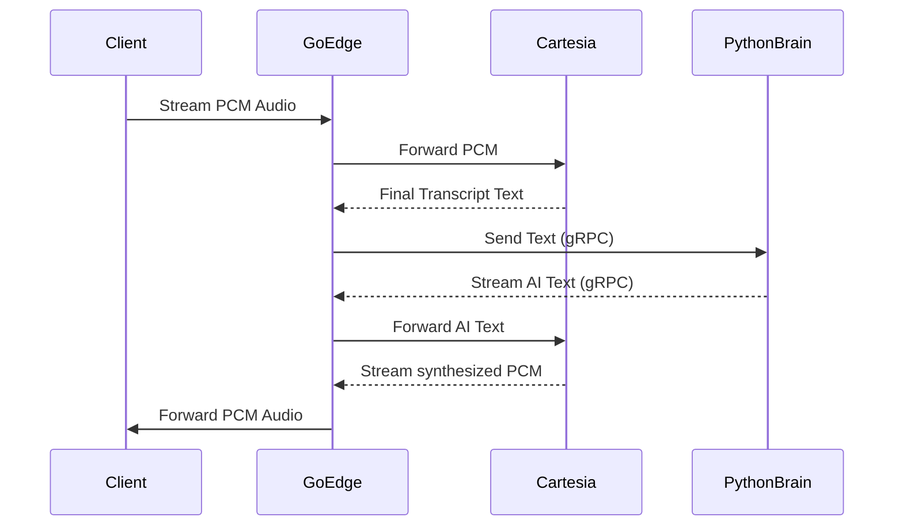

# Phase 3: The Edge (Go WebSockets & Cartesia)

## Objective
Connect the real-time audio pipeline and third-party APIs. Go will act as the high-throughput orchestrator, routing data between the Client, Cartesia (Voice APIs), Python (AI), and Xendit (Payments).

---

## 1. Project Structure
This phase expands the Go Gateway:
```text
gateway/
├── internal/
│   ├── cartesia/
│   │   ├── stt.go            # WebSocket client for Speech-to-Text
│   │   └── tts.go            # WebSocket client for Text-to-Speech
│   ├── ws/
│   │   ├── gateway.go        # Main WebSocket hub for Web UI clients
│   │   └── client.go         # Connection state for an individual user
│   └── payments/
│       └── xendit.go         # API wrapper & Webhook handler
└── cmd/server/main.go        # Assembles the pipeline
```

## 2. Cartesia WebSocket Clients
Implement `internal/cartesia/stt.go` and `tts.go`.

### Speech-to-Text (STT)
- Connect via WebSocket to Cartesia's STT endpoint.
- Accept a stream of PCM audio bytes from the frontend.
- Fire an event when a final `transcript` is returned.

### Text-to-Speech (TTS)
- Connect via WebSocket to Cartesia's Sonic TTS endpoint.
- Accept incoming text chunks from the Python gRPC response.
- Receive synthesized PCM audio bytes and pipe them down to the frontend.

## 3. Client WebSocket Gateway
Implement `internal/ws/gateway.go`.

- Upgrade incoming HTTP connections from the frontend to WebSockets.
- Define a strict JSON event schema for the frontend:
  ```json
  { "type": "audio_in", "data": "<base64_pcm>" }
  { "type": "ai_text", "data": "I can help with that." }
  { "type": "show_checkout", "url": "https://xendit.co/..." }
  ```

## 4. Xendit Payment Integration
Implement `internal/payments/xendit.go`.

- When Python calls `InitiateCheckout` via gRPC, Go triggers an HTTP request to Xendit's Invoice/QRIS API.
- Return the generated Invoice URL back to Python, and simultaneously broadcast a `show_checkout` event to the Client WebSocket.
- Expose a public HTTP endpoint `/webhooks/xendit` to listen for `invoice.paid` events. 
- Upon receiving payment, update SQLite status to `confirmed` and clear the Redis cache.

## 5. Pipeline Assembly
Implement the main loop in `cmd/server/main.go`.



---

## 6. Test Scenarios

### Automated Tests (`go test`)
- **Event Routing:** Write unit tests for the WebSocket event router to ensure incoming JSON is correctly mapped to internal Go structs.
- **Xendit Mocks:** Mock the Xendit API responses to test successful and failed invoice generation.

### Manual Verification
1. Start both the Go Gateway and the Python Brain.
2. Use `wscat` or Postman to connect to the Go WebSocket endpoint.
3. Send a mock `audio_in` event (or simulate a transcript event).
4. Verify the pipeline successfully routes the message to Python, back to Go, out to Cartesia, and returns audio bytes back through the WebSocket.
5. Use Postman to POST a mock Xendit webhook to `/webhooks/xendit` and verify the SQLite database updates the booking status.
